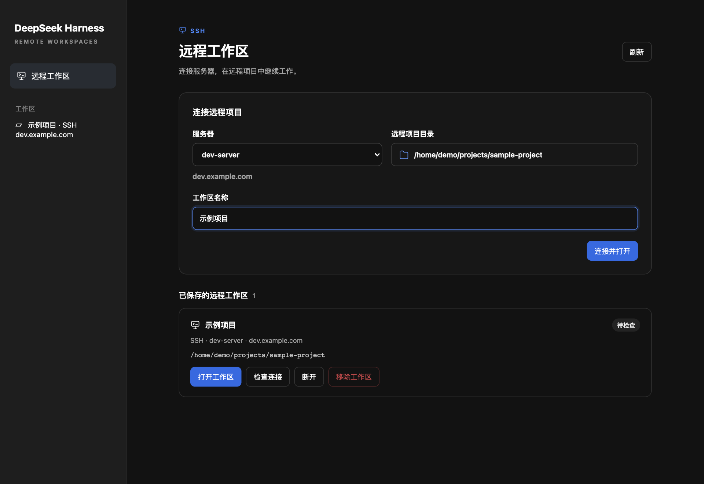
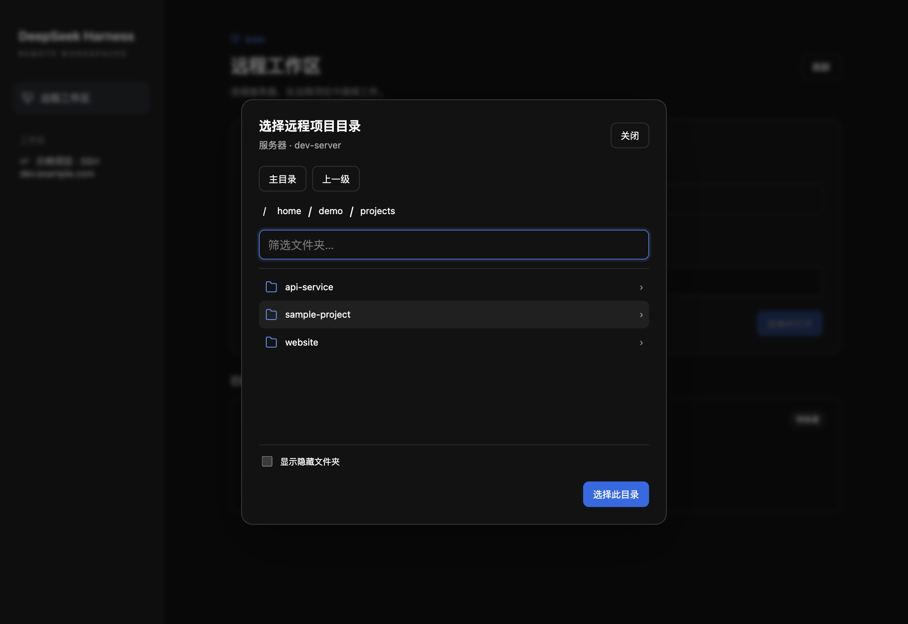

# DeepSeek Harness · Remote SSH

在 DeepSeek Harness 桌面侧边栏中连接 SSH 服务器，**浏览并选择远程项目目录**，直接打开远程工作区。本地工作区继续使用 Harness 原生沙箱。



## 目录选择

选择服务器 → 点击「选择服务器上的文件夹…」→ 打开项目文件夹 →「选择此目录」→「连接并打开」。

连接时可填写「工作区名称」，留空默认使用项目文件夹名。侧边栏显示「名称 · SSH 主机」，远程面板同时显示服务器别名、hostname 和远程目录。

目录选择器从服务器主目录开始，支持面包屑、上一级、文件夹筛选和隐藏目录。浏览不会创建工作区，确认连接后才保存。切换服务器会清空旧的目录选择。



## 环境要求

先在终端确认可以登录服务器。示例 `~/.ssh/config`：

```sshconfig
Host dev-server
  HostName dev.example.com
  User demo
  IdentityFile ~/.ssh/id_ed25519
```

```sh
ssh dev-server
```

上面的服务器地址是示例，请替换为自己的配置。`Include`、跳板机和密钥认证由系统 OpenSSH 处理。默认自动接受首次连接的新主机密钥，已知主机密钥变更会拒绝连接。

## 安装

### 从 GitHub 安装（推荐）

先启动一次 Harness，使 `desktop` 配置目录存在。然后将插件克隆到希望长期保留的位置：

```sh
git clone https://github.com/chenqaq123/dsh-remote-ssh.git
cd dsh-remote-ssh
git checkout v0.4.0
node scripts/profile.mjs install desktop
```

**完全退出并重新打开 DeepSeek Harness**，侧边栏会出现「远程工作区」。安装无运行时 npm 依赖，不需要执行 `npm install`。

安装器在 `~/.dsh/profiles/desktop/plugins/dsh-ssh-remote` 建立指向源码的符号链接，并向该 profile 的 `cordis.patch.yml` 添加独立管理区块。修改前自动备份，重复安装保留区块内的自定义配置。请保留源码目录。设置了 `DSH_HOME` 时，安装器会使用该位置；可将 `desktop` 替换成其他已有 profile 名称。

### 作为 npm 包安装

仓库包含完整 npm 包元数据和命令入口，可直接从 GitHub tag 安装，无需等待 npm registry 发布：

```sh
npm install -g --install-links git+https://github.com/chenqaq123/dsh-remote-ssh.git#v0.4.0
dsh-ssh-remote install desktop
```

`--install-links` 确保安装完整文件，避免部分 npm 版本将插件链接到随后被清理的 Git 临时缓存。使用全局包方式更新时也请保留此参数。

### 更新与卸载

更新源码或全局 npm 包后，重新运行安装命令并重启 Harness。卸载 GitHub 源码安装：

```sh
node scripts/profile.mjs uninstall desktop
```

全局包安装可运行 `dsh-ssh-remote uninstall desktop`，然后再卸载 npm 包。卸载只移除配置区块与插件链接，不删除远程文件或已保存的挂载数据。

## 移除远程工作区

「移除工作区」会归档相关会话并移除分组和远程映射，保留历史记录及服务器文件；侧边栏删除远程工作区也按此处理。有任务运行时，请先结束任务。

旧版本删除后留在「未分组」的会话，可在远程面板找到对应项目并点击「移除工作区」一并归档。「断开」只断开连接，保留分组和会话。

## 许可证

[MIT](LICENSE)。社区插件，与 DeepSeek 官方无隶属关系。
